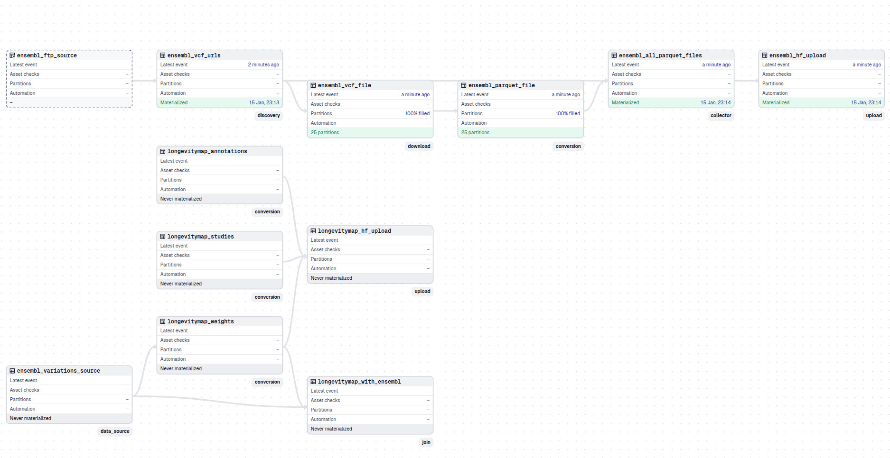

### Dagster Ensembl pipeline (prepare-annotations)

This repo includes a **Dagster** implementation of the Ensembl preparation pipeline as a parallel alternative to the Prefect flows.

The Dagster implementation lives under:
- `src/prepare_annotations/definitions.py` (main Dagster definitions)
- `src/prepare_annotations/assets/` (asset definitions)
- `src/prepare_annotations/pipelines/` (legacy location, backward compatible)

It is intentionally **file/directory based**: each asset materializes a concrete on-disk artifact (a JSON manifest, a directory of VCFs, a directory of Parquet files, etc.). This makes lineage inspectable and keeps memory usage predictable.

---

### Core principles

- **Lineage-first assets**: each asset returns a concrete on-disk artifact (Path) to avoid passing large in-memory objects.
- **Dynamic partitioning**: per-file assets are partitioned by filename for fine-grained lineage and UI progress.
- **Memory safety**: prefer streaming (`LazyFrame.sink_parquet` with `engine="streaming"` by default) and avoid eager materialization during conversion.
- **Scale-aware joins**: for joins that Polars would materialize in memory, prefer DuckDB or staged filtering.
- **Resource visibility**: download/convert steps log duration and peak memory where available.
- **Idempotent outputs**: assets skip work when target files are present and up-to-date.

---

### Key Features

- **Parallel downloads**: Configurable concurrent downloads (`max_concurrent_downloads`, default: 4)
- **Retry policies**: Dagster retry policy (max 3 attempts) plus downloader retries (default: 10)
- **Checksum verification**: BSD sum checksum validation using CHECKSUMS file from Ensembl FTP
- **Resumable downloads**: fsspec filecache-based resumption for interrupted transfers
- Uploads directly from the non-split Parquet directory (no legacy TSA splitting in Dagster)

---

### What it does

The default pipeline prepares Ensembl VCFs into Parquet format:
- **Discover** remote VCF URLs on the Ensembl FTP (per species)
- **Download** the VCFs in parallel (with retries, resume, and optional CHECKSUMS verification)
- **Convert** VCF → Parquet (streaming write; no full in-memory collect)
- **Optional**: upload the Parquet dataset to HuggingFace Hub

---

### Asset graph / lineage



#### Mermaid diagram

```mermaid
flowchart TD
  A[ensembl_ftp_source<br/>(external)] --> B[ensembl_vcf_urls<br/>vcf_urls.json]
  B --> C1[ensembl_vcf_file<br/>per-file download<br/>(partitioned)]
  C1 --> C2[ensembl_vcf_files<br/>vcf/ directory<br/>(batch downloads)]
  C2 --> D1[ensembl_parquet_file<br/>per-file conversion<br/>(partitioned)]
  D1 --> D2[ensembl_parquet_files<br/>species dir (*.parquet)]
  D2 --> F[ensembl_hf_upload<br/>(optional)]
```

#### ASCII diagram (fallback)

```
ensembl_ftp_source  (external)
        |
        v
ensembl_vcf_urls    (vcf_urls.json)
        |
        v
ensembl_vcf_file    (per-file download, partitioned)
        |
        v
ensembl_vcf_files   (vcf/ directory, parallel downloads with retries)
        |
        v
ensembl_parquet_file  (per-file conversion, partitioned)
        |
        v
ensembl_parquet_files (species directory with *.parquet)
        |
        v
ensembl_hf_upload   (optional)
```

---

### On-disk layout (default)

Paths are resolved via `src/prepare_annotations/pipelines/resources.py`.

By default the pipeline writes to your user cache (same convention as other Just DNA tooling):
- Base cache dir: `~/.cache/just-dna-pipelines/` (or `JUST_DNA_PIPELINES_CACHE_DIR`)

For Ensembl:
- `~/.cache/just-dna-pipelines/ensembl/{species}/`
  - `vcf_urls.json` (URL manifest)
  - `vcf/` (downloaded `.vcf.gz` files)
  - `*.parquet` (per-chromosome conversions, e.g. `homo_sapiens-chr1.parquet`)

---

### Memory/performance model

- **Parallel downloads** via `ThreadPoolExecutor` with configurable concurrency (`max_concurrent_downloads`).
- **Retry policy** with exponential backoff (30s initial delay, up to 3 retries) at the Dagster asset level.
- **Resumable downloads** via fsspec filecache (interrupted downloads resume from where they left off).
- **Checksum verification** using BSD sum (`CHECKSUMS` file from Ensembl FTP); corrupted files are automatically re-downloaded.
- **VCF → Parquet** uses `polars-bio` scanning and `LazyFrame.sink_parquet(..., engine="streaming")` to stream to disk by default.
- **Resource logging**: conversion and download steps record duration/peak memory when available.
- **Join strategy**: when Polars would materialize full datasets on joins, prefer DuckDB or pre-filtered joins to limit memory pressure.
- Dagster assets return **Paths** (manifest files / directories), not large Python lists, to avoid passing large in-memory objects between steps.

---

### How to run

#### Run via CLI (recommended)

Run the **full pipeline** (download → convert → upload):

```bash
uv run dagster-ensembl
```

This is equivalent to:

```bash
uv run dagster-ensembl run --job full
```

Run for a different species:

```bash
uv run dagster-ensembl run --species mus_musculus
```

Run specific jobs:

```bash
uv run dagster-ensembl run --job prepare   # download + convert (no upload)
uv run dagster-ensembl run --job download  # download only
uv run dagster-ensembl run --job convert   # convert only
uv run dagster-ensembl run --job upload    # upload only
```

List available jobs:

```bash
uv run dagster-ensembl jobs
```

Run LongevityMap conversion (Dagster module assets):

```bash
uv run dagster-ensembl longevitymap
uv run dagster-ensembl longevitymap --full
uv run dagster-ensembl longevitymap --upload
```

#### Run via Dagster UI

Start the web interface for interactive execution:

```bash
uv run dagster-ensembl ui
```

Then materialize assets / jobs from the UI.

---

### Jobs provided

Jobs are defined in `src/prepare_annotations/definitions.py`:

| Job | Description |
|-----|-------------|
| `full` | Complete pipeline: download → convert → upload **(default)** |
| `prepare` | Download and convert to Parquet (no upload) |
| `download` | Download VCF files only (parallel with retries) |
| `convert` | Convert VCF to Parquet (assumes VCFs downloaded) |
| `upload` | Upload to HuggingFace Hub (assumes parquet exists) |
| `longevitymap` | Convert LongevityMap to unified schema (with Ensembl genotype resolution) |
| `longevitymap_full` | Convert LongevityMap and join with full Ensembl data |
| `longevitymap_upload` | Convert LongevityMap and upload to `just-dna-seq/annotators` |

---

### Configuration options

Key configuration parameters (set via Dagster config):

**EnsemblDownloadConfig:**
- `species`: Species name (default: `homo_sapiens`)
- `base_url`: Ensembl FTP base URL (default: `https://ftp.ensembl.org/pub/current_variation/vcf/`)
- `pattern`: Regex to filter remote files (default: species-aware pattern)
- `cache_dir`: Override cache directory (default: `~/.cache/just-dna-pipelines/ensembl/{species}`)
- `max_concurrent_downloads`: Maximum parallel downloads (default: `4`)
- `verify_checksums`: Whether to verify checksums (default: `True`)
- `force_download`: Re-download even if files already exist (default: `False`)
- `http_max_pool`: HTTP pool size for downloader (default: `20`)
- `retries`: Number of retry attempts per file (default: `10`)
- `connect_timeout`: Connection timeout in seconds (default: `10.0`)
- `sock_read_timeout`: Socket read timeout in seconds (default: `120.0`)

**ParquetConversionConfig:**
- `max_concurrent_conversions`: Maximum parallel conversions. If unset, uses `PREPARE_ANNOTATIONS_PARQUET_WORKERS` env var; defaults to `2`.
- `threads`: Thread count per conversion (auto-detected if not set).
- `force_convert`: Re-convert even when parquet is up-to-date.

**Environment overrides:**
- `PREPARE_ANNOTATIONS_PARQUET_WORKERS`: Max concurrent parquet conversions (used when config not set).

### HuggingFace upload lineage

The upload asset (`ensembl_hf_upload`) depends on the parquet directory output (`ensembl_parquet_files`). In the Dagster UI, this makes it straightforward to answer:
- "Which local dataset was uploaded?"
- "When did we last upload, and what was uploaded vs skipped?"

Uploads are executed using the existing uploader implementation:
- `prepare_annotations.huggingface.uploader.upload_parquet_to_hf`

