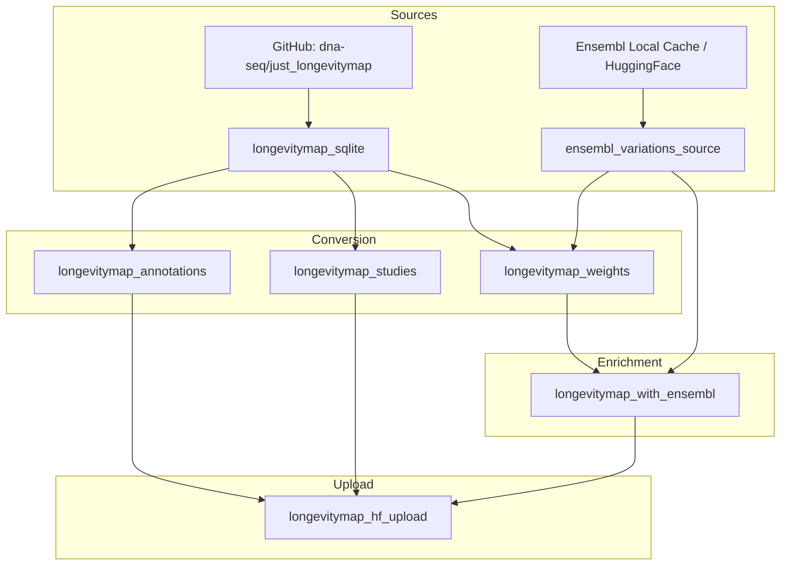

### Dagster LongevityMap Pipeline (prepare-annotations)

This document describes the **Dagster** implementation of the LongevityMap module conversion pipeline.

The LongevityMap pipeline converts curated longevity-associated variant data from the [dna-seq/just_longevitymap](https://github.com/dna-seq/just_longevitymap) repository into the unified annotation schema, with genotype expansion using Ensembl variation data.

---

### Core Principles

- **Unified schema output**: Produces three standardized Parquet tables (annotations, studies, weights) following the [modules schema](modules_schema.md).
- **Ensembl genotype resolution**: Heterozygous variants are expanded using Ensembl reference allele data.
- **Strand normalization**: Automatically handles alleles on opposite DNA strands via complement matching (A↔T, C↔G).
- **DuckDB-powered joins**: Memory-efficient joins with Ensembl data (handles 700M+ variants without OOM).
- **Lazy streaming**: Uses Polars `LazyFrame.sink_parquet(..., engine="streaming")` for memory-safe writes.
- **Multi-source Ensembl**: Can use local Dagster pipeline cache OR stream directly from HuggingFace Hub.
- **Idempotent outputs**: Assets skip work when target files exist and source hasn't changed.

---

### Key Features

- **Automatic download**: Downloads LongevityMap SQLite from GitHub if not cached locally
- **Genotype expansion**: Correctly handles homozygous, heterozygous+spec, and heterozygous+alt variants
- **Strand normalization**: Automatically handles alleles recorded on opposite DNA strands (A↔T, C↔G complement)
- **Ensembl enrichment**: Joins weights with Ensembl for chromosome, position, and ClinVar annotations
- **Study conclusions**: Preserves study-level conclusions from the variant table in weights output
- **HuggingFace upload**: Batch upload to `just-dna-seq/annotators` repository
- **Curator metadata**: Preserves provenance (curator, method) in all output tables

---

### What It Does

The LongevityMap pipeline converts the SQLite database into three Parquet tables:

1. **annotations.parquet**: Variant-level facts (rsid → gene, phenotype, category)
2. **studies.parquet**: Per-study evidence (rsid → pmid, population, conclusion)
3. **weights.parquet**: Curator-defined scoring with Ensembl enrichment (rsid, genotype → weight, state, chromosomal location)

---

### Asset Graph / Lineage

#### Mermaid Diagram



#### ASCII Diagram (Fallback)

```
GitHub (dna-seq/just_longevitymap)     Ensembl (Local Cache / HuggingFace)
              |                                       |
              v                                       v
    longevitymap_sqlite              ensembl_variations_source
              |                                       |
              +---------------+---------------+-------+
              |               |               |
              v               v               v
  longevitymap_annotations  longevitymap_studies  longevitymap_weights
              |               |               |
              |               |               v
              |               |      longevitymap_with_ensembl
              |               |               |
              +---------------+---------------+
                              |
                              v
                    longevitymap_hf_upload
                              |
                              v
              just-dna-seq/annotators (HuggingFace)
```

---

### Asset Descriptions

| Asset | Description | Output |
|-------|-------------|--------|
| `ensembl_variations_source` | Resolves Ensembl data source (local cache or HuggingFace) | Source path string |
| `longevitymap_sqlite` | Downloads LongevityMap SQLite from GitHub | `modules/just_longevitymap/longevitymap.sqlite` |
| `longevitymap_annotations` | Converts to annotations schema | `annotations.parquet` |
| `longevitymap_studies` | Converts to studies schema | `studies.parquet` |
| `longevitymap_weights` | Converts weights with Ensembl genotype resolution | `weights.parquet` |
| `longevitymap_with_ensembl` | Joins weights with full Ensembl data (DuckDB) | `longevitymap_ensembl_joined.parquet` |
| `longevitymap_hf_upload` | Uploads all parquet files to HuggingFace Hub | Upload result dict |

---

### Output Schema

#### annotations.parquet

| Column | Type | Description |
|--------|------|-------------|
| `rsid` | String | Variant identifier (e.g., "rs7412") |
| `module` | String | "longevitymap" |
| `gene` | String | Curated gene symbol |
| `phenotype` | String | "longevity" |
| `category` | String | Category (e.g., "lipids", "insulin", "immunity") |

**Primary Key**: `(rsid, module)`

#### studies.parquet

| Column | Type | Description |
|--------|------|-------------|
| `rsid` | String | Variant identifier |
| `module` | String | "longevitymap" |
| `pmid` | String | PubMed ID |
| `population` | String | Study population (e.g., "European", "Asian") |
| `p_value` | String | Statistical significance (null for LongevityMap) |
| `conclusion` | String | Study-specific conclusion text |
| `study_design` | String | Study design description |

**Primary Key**: `(rsid, module, pmid)`

#### weights.parquet (Enriched)

| Column | Type | Description |
|--------|------|-------------|
| `rsid` | String | Variant identifier |
| `genotype` | List[String] | Normalized genotype (e.g., ["C", "T"]) |
| `module` | String | "longevitymap" |
| `weight` | Float64 | Numeric weight score |
| `state` | String | "protective", "risk", or "neutral" |
| `priority` | String | Priority level |
| `conclusion` | String | Study-level conclusion text (from variant table) |
| `curator` | String | "Olga Borysova" |
| `method` | String | "literature_review" |
| `chrom` | String | Chromosome (from Ensembl) |
| `start` | Int64 | Start position (from Ensembl) |
| `end` | Int64 | End position (from Ensembl) |
| `ref` | String | Reference allele (from Ensembl) |
| `alts` | List[String] | Alternative alleles (from Ensembl) |
| `clinvar` | String | ClinVar annotation (from Ensembl) |
| `pathogenic` | Int32 | ClinVar pathogenic flag |
| `benign` | Int32 | ClinVar benign flag |
| `likely_pathogenic` | Int32 | ClinVar likely pathogenic flag |
| `likely_benign` | Int32 | ClinVar likely benign flag |

**Primary Key**: `(rsid, genotype, module)`

---

### Genotype Expansion Logic

LongevityMap stores variants with three zygosity/state combinations that require different handling:

#### 1. Homozygous (`zygosity = "hom"`)

Simple duplication: allele "C" → genotype `["C", "C"]`

```
Input:  rsid=rs123, allele="C", zygosity="hom"
Output: rsid=rs123, genotype=["C", "C"]
```

#### 2. Heterozygous + Specific (`zygosity = "het"`, `state = "spec"`)

The allele column contains the full 2-character genotype: allele "CT" → genotype `["C", "T"]`

```
Input:  rsid=rs123, allele="CT", zygosity="het", state="spec"
Output: rsid=rs123, genotype=["C", "T"]
```

#### 3. Heterozygous + Alt (`zygosity = "het"`, `state = "alt"`)

Requires Ensembl join to determine the other allele. The curated allele pairs with:
- The reference allele (if ref ≠ curated allele)
- Any alternative allele (if alt ≠ curated allele)

This can produce **multiple rows** per input variant.

```
Input:  rsid=rs123, allele="C", zygosity="het", state="alt"
Ensembl: rsid=rs123, ref="T", alts=["C", "G"]

Output (2 rows):
  rsid=rs123, genotype=["C", "T"]  (C pairs with ref T)
  rsid=rs123, genotype=["C", "G"]  (C pairs with alt G)
```

#### Normalization

All genotypes are normalized to **alphabetical order** for consistent matching:
- `"GA"` → `["A", "G"]`
- `"TC"` → `["C", "T"]`

---

### Strand Normalization

Some variants in LongevityMap are recorded on the opposite DNA strand compared to Ensembl's representation. The pipeline automatically handles this by checking both the original allele and its complement during joins.

#### Complement Mapping

| Original | Complement |
|----------|------------|
| A | T |
| T | A |
| C | G |
| G | C |

#### Example

```
LongevityMap: rs4880, allele="C"
Ensembl:      rs4880, ref="A", alts=["G"]

Without strand normalization: NO MATCH (C not in [A, G])
With strand normalization:    MATCH (complement of C is G, which is in alts)

Result: Variant is correctly joined using the complemented allele
```

#### Affected Variants

A small number of LongevityMap variants (~4 RSIDs) use opposite strand notation. Without strand normalization, these would be excluded from the Ensembl-enriched output. The pipeline now correctly includes all variants by trying both the original allele and its complement when matching against Ensembl ref/alts.

---

### DuckDB Join Strategy

The `longevitymap_with_ensembl` asset uses DuckDB for memory-efficient joins with Ensembl data (~700M variants). Key optimizations:

1. **Memory limit**: Auto-detected from available RAM (60% of available, max 64GB)
2. **Temp directory**: Spills to disk if memory is tight
3. **Streaming read**: Parquet files read in chunks, not fully materialized
4. **Allele matching**: Joins where curated allele (or its complement) is in `ref` OR `alts` list
5. **Strand normalization**: Computes complement alleles and matches against both original and complement

```sql
-- Simplified join logic with strand normalization
SELECT w.*, e.chrom, e.start, e.end, e.ref, e.alts, e.clinvar
FROM weights_exploded w
JOIN ensembl e ON e.id = w.rsid
WHERE w.allele = e.ref OR list_contains(e.alts, w.allele)
   -- Strand normalization: also match complement alleles
   OR w.allele_complement = e.ref 
   OR list_contains(e.alts, w.allele_complement)
```

---

### On-Disk Layout

All paths are relative to the repository root (`prepare-annotations/`):

```
prepare-annotations/
├── data/
│   ├── modules/
│   │   └── just_longevitymap/
│   │       └── longevitymap.sqlite        # Downloaded from GitHub (~2MB)
│   │
│   └── output/
│       └── modules/
│           └── longevitymap/
│               ├── annotations.parquet    # Variant-level facts
│               ├── studies.parquet        # Per-study evidence
│               ├── weights.parquet        # Weights with genotype expansion
│               └── longevitymap_ensembl_joined.parquet  # Enriched with Ensembl
```

**Path constants** (from `src/prepare_annotations/core/paths.py`):
- `MODULES_DIR` = `data/modules/` — SQLite downloads
- `MODULES_OUTPUT_DIR` = `data/output/modules/` — Parquet outputs

These paths can be overridden via:
- `LongevityMapConfig.output_dir` — Override output directory
- Environment variable `JUST_DNA_PIPELINES_OUTPUT_DIR` — Override base output directory

---

### How to Run

#### Run via CLI (Recommended)

Convert LongevityMap with Ensembl enrichment and upload to HuggingFace:

```bash
uv run prepare longevitymap
```

Convert and join with Ensembl, but skip upload:

```bash
uv run prepare longevitymap --no-upload
```

Convert only (no Ensembl join, no upload):

```bash
uv run prepare longevitymap --convert-only
```

Use local Ensembl cache instead of HuggingFace:

```bash
uv run prepare longevitymap --prefer-local
```

Force re-download of SQLite:

```bash
uv run prepare longevitymap --force-download
```

#### Run via Dagster UI

Start the web interface:

```bash
uv run dagster-ui
```

Then materialize assets from the UI:
1. Navigate to Assets
2. Select `longevitymap_*` assets
3. Click "Materialize"

---

### Jobs Provided

Jobs are defined in `src/prepare_annotations/definitions.py`:

| Job | CLI Option | Description |
|-----|------------|-------------|
| `longevitymap` | (default) | Full pipeline: download → convert → join with Ensembl → upload to HuggingFace |
| `longevitymap_full` | `--no-upload` | Convert + join with Ensembl (no upload) |
| `longevitymap_convert` | `--convert-only` | Convert to unified schema only (no Ensembl join, no upload) |

---

### Configuration Options

#### EnsemblSourceConfig

| Parameter | Type | Default | Description |
|-----------|------|---------|-------------|
| `species` | str | `"homo_sapiens"` | Species name |
| `prefer_local` | bool | `True` | Prefer local cache over HuggingFace |
| `local_cache_path` | str | `None` | Override local cache path |
| `hf_repo` | str | `"just-dna-seq/ensembl_variations"` | HuggingFace dataset repository |

#### LongevityMapSourceConfig

| Parameter | Type | Default | Description |
|-----------|------|---------|-------------|
| `download_url` | str | GitHub raw URL | URL to download SQLite |
| `force_download` | bool | `False` | Re-download even if cached |

#### LongevityMapConfig

| Parameter | Type | Default | Description |
|-----------|------|---------|-------------|
| `module_name` | str | `"longevitymap"` | Module name in output |
| `curator` | str | `"Olga Borysova"` | Curator name |
| `method` | str | `"literature_review"` | Curation method |
| `output_dir` | str | `None` | Override output directory |

#### AnnotatorsUploadConfig

| Parameter | Type | Default | Description |
|-----------|------|---------|-------------|
| `repo_id` | str | `"just-dna-seq/annotators"` | HuggingFace repository |
| `path_prefix` | str | `"data"` | Path prefix in repository |
| `token` | str | `None` | HuggingFace token (uses `HF_TOKEN` env if not set) |

---

### Memory/Performance Model

- **SQLite download**: Cached locally (~2MB), only downloaded once
- **Ensembl source resolution**: Prefers local cache, falls back to HuggingFace streaming
- **DuckDB joins**: Memory limit auto-detected, spills to disk if needed
- **Polars streaming**: Uses `sink_parquet(..., engine="streaming")` for memory-safe writes
- **Concurrent conversions**: Limited by `dagster/concurrency_key: module_conversion`

---

### Data Statistics (Typical)

| Table | Rows | Unique RSIDs |
|-------|------|--------------|
| annotations | ~600 | ~528 |
| studies | ~1,800 | ~528 |
| weights | ~1,043 | ~528 |

Key variants include:
- **rs7412** (APOE ε2): protective weights for longevity
- **rs429358** (APOE ε4): risk weights for longevity

---

### HuggingFace Upload

The upload asset (`longevitymap_hf_upload`) publishes to `just-dna-seq/annotators`:

```
https://huggingface.co/datasets/just-dna-seq/annotators/
├── data/
│   └── longevitymap/
│       ├── annotations.parquet
│       ├── studies.parquet
│       └── weights.parquet    # This is longevitymap_ensembl_joined.parquet
└── README.md
```

Features:
- **Batch upload**: Single commit for all files
- **Size-based skip**: Only uploads files that differ from remote
- **Dataset card**: Auto-generates README.md with schema documentation

---

### Usage Examples

#### Load from HuggingFace

```python
import polars as pl

# Load weights with Ensembl enrichment
weights = pl.read_parquet(
    "hf://datasets/just-dna-seq/annotators/data/longevitymap/weights.parquet"
)

# Filter to protective variants
protective = weights.filter(pl.col("state") == "protective")
print(f"Found {len(protective)} protective genotype-weight combinations")
```

#### Join with User Genotypes

```python
import polars as pl

# User's genotype data
user_genotypes = pl.DataFrame({
    "rsid": ["rs7412", "rs429358"],
    "user_genotype": ["CT", "TC"]
}).with_columns(
    # Normalize to list format
    pl.col("user_genotype").map_elements(
        lambda g: sorted(list(g)) if g else None,
        return_dtype=pl.List(pl.Utf8)
    ).alias("genotype")
)

# Load weights
weights = pl.scan_parquet(
    "hf://datasets/just-dna-seq/annotators/data/longevitymap/weights.parquet"
)

# Join to get applicable weights
scored = user_genotypes.join(
    weights.collect(),
    on=["rsid", "genotype"],
    how="left"
)
print(scored.select("rsid", "genotype", "weight", "state"))
```

---

### Testing

Tests are located in `tests/test_longevitymap_module.py` and validate:

1. **Row counts**: Match between SQLite and Parquet
2. **Weight values**: Sum, min, max, mean preserved
3. **APOE variants**: rs7412/rs429358 weights correct
4. **Genotype normalization**: Alphabetical ordering
5. **State derivation**: protective/risk/neutral from weight sign
6. **Studies/Annotations**: PMIDs, categories, populations preserved

Run tests:

```bash
# All LongevityMap tests
uv run pytest tests/test_longevitymap_module.py -v

# Specific validation
uv run pytest tests/test_longevitymap_module.py -k "apoe" -v
```

---

### Related Documentation

- [Unified Module Schema](modules_schema.md) - Complete schema specification
- [Dagster Ensembl Pipeline](DAGSTER_ENSEMBL_PIPELINE.md) - Ensembl VCF preparation
- [AGENTS.md](../AGENTS.md) - Repository coding standards
