### Dagster Annotation Modules Pipeline (prepare-annotations)

This document describes the **Dagster** implementation for all annotation module conversion pipelines.

Each module converts curated variant data from the [dna-seq](https://github.com/dna-seq) GitHub repositories into the unified annotation schema, with optional upload to HuggingFace Hub.

---

### Core Principles

- **Unified schema output**: Produces three standardized Parquet tables (annotations, studies, weights) following the [modules schema](modules_schema.md).
- **Lazy streaming**: Uses Polars `LazyFrame.sink_parquet(..., engine="streaming")` for memory-safe writes.
- **dagster-polars integration**: Small assets use `PolarsParquetIOManager` for automatic schema visibility in UI.
- **Asset checks**: All jobs include validation checks for schema, value constraints, and data quality.
- **Idempotent downloads**: SQLite databases are cached locally and only re-downloaded if `force_download=True`.
- **Batch HuggingFace upload**: All files uploaded in single commits for efficiency.

---

### Available Modules

| Module | Description | GitHub Repo | Ensembl Join | dagster-polars |
|--------|-------------|-------------|--------------|----------------|
| `longevitymap` | Longevity-associated variants | dna-seq/just_longevitymap | ✅ Yes | ✅ annotations, studies |
| `lipidmetabolism` | Lipid metabolism variants | dna-seq/just_lipidmetabolism | ✅ Yes | ❌ |
| `vo2max` | VO2max/athletic performance | dna-seq/just_vo2max | ✅ Yes | ❌ |
| `superhuman` | Elite performance genetics | dna-seq/just_superhuman | ✅ Yes | ❌ |
| `coronary` | Coronary disease variants | dna-seq/just_coronary | ✅ Yes | ❌ |

---

### Asset Graph / Lineage

```mermaid
flowchart TD
    subgraph Sources
        GH1[GitHub: dna-seq/just_longevitymap] --> LM_DB[longevitymap_sqlite]
        GH2[GitHub: dna-seq/just_lipidmetabolism] --> LIP_DB[lipidmetabolism_sqlite]
        GH3[GitHub: dna-seq/just_vo2max] --> VO2_DB[vo2max_sqlite]
        GH4[GitHub: dna-seq/just_superhuman] --> SH_DB[superhuman_sqlite]
        GH5[GitHub: dna-seq/just_coronary] --> COR_DB[coronary_sqlite]
        ENS[Ensembl Local Cache / HuggingFace] --> ENS_SRC[ensembl_variations_source]
    end
    
    subgraph LongevityMap
        LM_DB --> LM_ANN[longevitymap_annotations]
        LM_DB --> LM_STD[longevitymap_studies]
        LM_DB & ENS_SRC --> LM_WGT[longevitymap_weights]
        ENS_SRC & LM_WGT --> LM_ENS[longevitymap_with_ensembl]
        LM_ANN & LM_STD & LM_ENS --> LM_UP[longevitymap_hf_upload]
    end
    
    subgraph LipidMetabolism
        LIP_DB --> LIP_ANN[lipidmetabolism_annotations]
        LIP_DB --> LIP_STD[lipidmetabolism_studies]
        LIP_DB --> LIP_WGT[lipidmetabolism_weights]
        LIP_ANN & LIP_STD & LIP_WGT --> LIP_UP[lipidmetabolism_hf_upload]
    end
    
    subgraph VO2Max
        VO2_DB --> VO2_ANN[vo2max_annotations]
        VO2_DB --> VO2_STD[vo2max_studies]
        VO2_DB --> VO2_WGT[vo2max_weights]
        VO2_ANN & VO2_STD & VO2_WGT --> VO2_UP[vo2max_hf_upload]
    end
    
    subgraph Superhuman
        SH_DB --> SH_ANN[superhuman_annotations]
        SH_DB --> SH_STD[superhuman_studies]
        SH_DB --> SH_WGT[superhuman_weights]
        SH_ANN & SH_STD & SH_WGT --> SH_UP[superhuman_hf_upload]
    end
    
    subgraph Coronary
        COR_DB --> COR_ANN[coronary_annotations]
        COR_DB --> COR_STD[coronary_studies]
        COR_DB --> COR_WGT[coronary_weights]
        COR_ANN & COR_STD & COR_WGT --> COR_UP[coronary_hf_upload]
    end
    
    subgraph Upload
        LM_UP --> HF[just-dna-seq/annotators]
        LIP_UP --> HF
        VO2_UP --> HF
        SH_UP --> HF
        COR_UP --> HF
    end
```



---

### Output Schema

All modules produce three parquet files following the unified schema:

#### annotations.parquet

| Column | Type | Description |
|--------|------|-------------|
| `rsid` | String | Variant identifier (e.g., "rs7412") |
| `module` | String | Module name |
| `gene` | String | Curated gene symbol |
| `phenotype` | String | Trait or phenotype |
| `category` | String | Module-specific category |

#### studies.parquet

| Column | Type | Description |
|--------|------|-------------|
| `rsid` | String | Variant identifier |
| `module` | String | Module name |
| `pmid` | String | PubMed ID |
| `population` | String | Study population |
| `p_value` | String | Statistical significance |
| `conclusion` | String | Study conclusion |
| `study_design` | String | Study design description |

#### weights.parquet

| Column | Type | Description |
|--------|------|-------------|
| `rsid` | String | Variant identifier |
| `genotype` | List[String] | Normalized genotype (e.g., ["C", "T"]) |
| `module` | String | Module name |
| `weight` | Float64 | Numeric weight (NULL for superhuman) |
| `state` | String | "protective", "risk", or "neutral" |
| `priority` | String | Priority level |
| `conclusion` | String | Genotype-specific conclusion |
| `curator` | String | Curator name |
| `method` | String | Curation method |

---

### Module-Specific Notes

#### LongevityMap

- **Curator**: Olga Borysova
- **Method**: literature_review
- **Special**: Includes Ensembl genotype resolution for heterozygous variants
- **Ensembl Join**: Creates `longevitymap_with_ensembl` asset with chromosomal positions and ClinVar annotations

#### LipidMetabolism

- **Curator**: Olga Borysova
- **Method**: literature_review
- **SQLite table**: `rsids` for studies/annotations, `weight` for weights

#### VO2Max

- **Curator**: Olga Borysova
- **Method**: literature_review
- **SQLite table**: `rsid` for studies/annotations, `genotype_weights` for weights
- **Note**: Column name is `rsID` not `rsid` in genotype_weights table

#### Superhuman

- **Curator**: Olga Borysova
- **Method**: literature_review
- **Special**: No numeric weights (NULL in weight column)
- **State derivation**: From `superability` (protective) or `adverse_effects` (risk)

#### Coronary

- **Curator**: Olga Borysova
- **Method**: gwas_literature
- **SQLite table**: `coronary_disease`

---

### IO Managers

The pipeline uses multiple IO managers for different asset types:

| IO Manager | Assets | Purpose |
|------------|--------|---------|
| `polars_parquet_io_manager` | `longevitymap_annotations`, `longevitymap_studies` | Automatic schema visibility, sample preview |
| `module_io_manager` | All other parquet assets | Path-based storage for large data, DuckDB joins |
| `hf_upload_io_manager` | `*_hf_upload` assets | Upload result tracking |

#### dagster-polars Benefits

Assets using `polars_parquet_io_manager` get automatic:
- **Schema metadata** - Column names and types in Dagster UI
- **Sample data preview** - First rows displayed
- **Row count** - Automatic counting
- **Streaming writes** - Memory-efficient `sink_parquet()`

#### File Storage Locations

- **dagster-polars assets**: `data/output/modules/{asset_key}.parquet`
- **Path-based assets**: `data/output/modules/{module_name}/{file}.parquet`

---

### Asset Checks

All module conversion jobs include validation checks that run after materialization:

| Check | Validates |
|-------|-----------|
| `check_{module}_weights` | Schema, genotype format, state values, weight constraints |
| `check_{module}_annotations` | Schema, module column, required columns |
| `check_{module}_studies` | Schema, module column, PMID format |

Checks are:
- **LazyFrame-based**: Use `pl.scan_parquet()` to avoid loading full data
- **Fail-fast**: Return early on first failure
- **Metadata-rich**: Include debugging info in results

#### Running Checks

Checks run automatically with jobs:

```bash
# Jobs include checks via AssetSelection.checks_for_assets()
uv run prepare longevitymap  # Runs assets + checks
```

Or run checks explicitly in Dagster UI under "Asset Checks" tab.

---

### On-Disk Layout

```
prepare-annotations/
├── data/
│   ├── modules/
│   │   ├── just_longevitymap/
│   │   │   └── longevitymap.sqlite
│   │   ├── just_lipidmetabolism/
│   │   │   └── lipid_metabolism.sqlite
│   │   ├── just_vo2max/
│   │   │   └── vo2max.sqlite
│   │   ├── just_superhuman/
│   │   │   └── superhuman.sqlite
│   │   └── just_coronary/
│   │       └── coronary.sqlite
│   │
│   └── output/
│       └── modules/
│           ├── longevitymap/
│           │   ├── annotations.parquet
│           │   ├── studies.parquet
│           │   ├── weights.parquet
│           │   └── longevitymap_ensembl_joined.parquet
│           ├── lipidmetabolism/
│           │   ├── annotations.parquet
│           │   ├── studies.parquet
│           │   └── weights.parquet
│           ├── vo2max/
│           │   └── ...
│           ├── superhuman/
│           │   └── ...
│           └── coronary/
│               └── ...
```

---

### How to Run

#### Recommended: CLI Commands

```bash
# LongevityMap (with Ensembl join + checks)
uv run prepare longevitymap

# LipidMetabolism
uv run prepare lipidmetabolism

# VO2Max
uv run prepare vo2max

# Superhuman
uv run prepare superhuman

# Coronary
uv run prepare coronary

# All modules at once
uv run prepare all-modules
```

#### Convert Only (No Upload)

```bash
uv run prepare longevitymap --convert-only
uv run prepare lipidmetabolism --convert-only
uv run prepare all-modules --convert-only
```

#### Run via Dagster UI

```bash
uv run dagster-ui
```

Then navigate to Jobs in the UI to materialize assets and view asset checks.

#### Alternative: Dagster Dev Server

```bash
# Start dev server with hot reload
uv run dagster dev -m prepare_annotations.definitions

# Open http://localhost:3000 to access UI
```

> **Note**: Avoid using `dagster job execute` CLI - it's deprecated. Use the `uv run prepare` commands or Dagster UI instead.

---

### Jobs Provided

All jobs include asset checks for validation.

| Job | Description | Includes Checks |
|-----|-------------|-----------------|
| `longevitymap` | Full: convert + Ensembl join + upload | ✅ |
| `longevitymap_full` | Convert + Ensembl join (no upload) | ✅ |
| `longevitymap_convert` | Convert only | ✅ |
| `lipidmetabolism` | Full: convert + Ensembl join + upload | ✅ |
| `lipidmetabolism_full` | Convert + Ensembl join (no upload) | ✅ |
| `lipidmetabolism_convert` | Convert only | ✅ |
| `vo2max` | Full: convert + Ensembl join + upload | ✅ |
| `vo2max_full` | Convert + Ensembl join (no upload) | ✅ |
| `vo2max_convert` | Convert only | ✅ |
| `superhuman` | Full: convert + Ensembl join + upload | ✅ |
| `superhuman_full` | Convert + Ensembl join (no upload) | ✅ |
| `superhuman_convert` | Convert only | ✅ |
| `coronary` | Full: convert + Ensembl join + upload | ✅ |
| `coronary_full` | Convert + Ensembl join (no upload) | ✅ |
| `coronary_convert` | Convert only | ✅ |
| `all_modules` | Full pipeline for all modules | ✅ |
| `all_modules_full` | All modules + Ensembl joins (no upload) | ✅ |
| `all_modules_convert` | Convert all modules (no upload) | ✅ |

---

### Configuration

Each module has two config classes:

#### Source Config (for SQLite download)

| Module | Config Class | Key Options |
|--------|--------------|-------------|
| LongevityMap | `LongevityMapSourceConfig` | `github_repo`, `file_path`, `force_download` |
| LipidMetabolism | `LipidMetabolismSourceConfig` | Same pattern |
| VO2Max | `VO2MaxSourceConfig` | Same pattern |
| Superhuman | `SuperhumanSourceConfig` | Same pattern |
| Coronary | `CoronarySourceConfig` | Same pattern |

#### Conversion Config

| Module | Config Class | Key Options |
|--------|--------------|-------------|
| LongevityMap | `LongevityMapConfig` | `module_name`, `curator`, `method`, `output_dir` |
| LipidMetabolism | `LipidMetabolismConfig` | Same pattern |
| VO2Max | `VO2MaxConfig` | Same pattern |
| Superhuman | `SuperhumanConfig` | Same pattern |
| Coronary | `CoronaryConfig` | Same pattern |

#### Upload Config

All modules share `AnnotatorsUploadConfig`:

| Parameter | Default | Description |
|-----------|---------|-------------|
| `repo_id` | `just-dna-seq/annotators` | HuggingFace repository |
| `path_prefix` | `data` | Path prefix in repository |
| `token` | `None` | Uses `HF_TOKEN` env var if not set |

---

### HuggingFace Upload Structure

Files are uploaded to `just-dna-seq/annotators`:

```
https://huggingface.co/datasets/just-dna-seq/annotators/
├── data/
│   ├── longevitymap/
│   │   ├── annotations.parquet
│   │   ├── studies.parquet
│   │   └── weights.parquet
│   ├── lipidmetabolism/
│   │   ├── annotations.parquet
│   │   ├── studies.parquet
│   │   └── weights.parquet
│   ├── vo2max/
│   │   └── ...
│   ├── superhuman/
│   │   └── ...
│   └── coronary/
│       └── ...
└── README.md
```

---

### Usage Examples

#### Load from HuggingFace

```python
import polars as pl

# Load any module's weights
weights = pl.read_parquet("hf://datasets/just-dna-seq/annotators/data/lipidmetabolism/weights.parquet")

# Load all modules at once
modules = ["longevitymap", "lipidmetabolism", "vo2max", "superhuman", "coronary"]
all_weights = pl.concat([
    pl.read_parquet(f"hf://datasets/just-dna-seq/annotators/data/{m}/weights.parquet")
    for m in modules
])
```

#### Join with User Genotypes

```python
import polars as pl

# User genotypes
user_genotypes = pl.DataFrame({
    "rsid": ["rs7412", "rs1800206"],
    "genotype": [["C", "T"], ["C", "G"]]
})

# Load weights from multiple modules
weights = pl.scan_parquet("hf://datasets/just-dna-seq/annotators/data/*/weights.parquet")

# Join to get applicable weights
scored = user_genotypes.join(
    weights.collect(),
    on=["rsid", "genotype"],
    how="left"
)
```

---

### Related Documentation

- [LongevityMap Pipeline Details](DAGSTER_LONGEVITYMAP_PIPELINE.md) - Detailed LongevityMap-specific documentation
- [Unified Module Schema](modules_schema.md) - Complete schema specification
- [Dagster Ensembl Pipeline](DAGSTER_ENSEMBL_PIPELINE.md) - Ensembl VCF preparation
- [AGENTS.md](../AGENTS.md) - Repository coding standards
